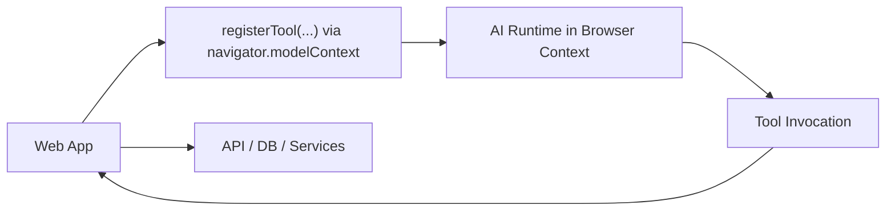
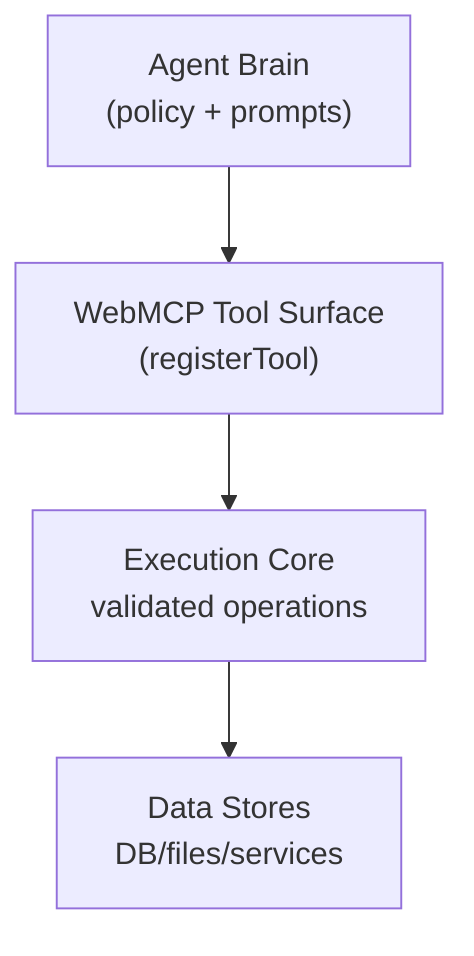
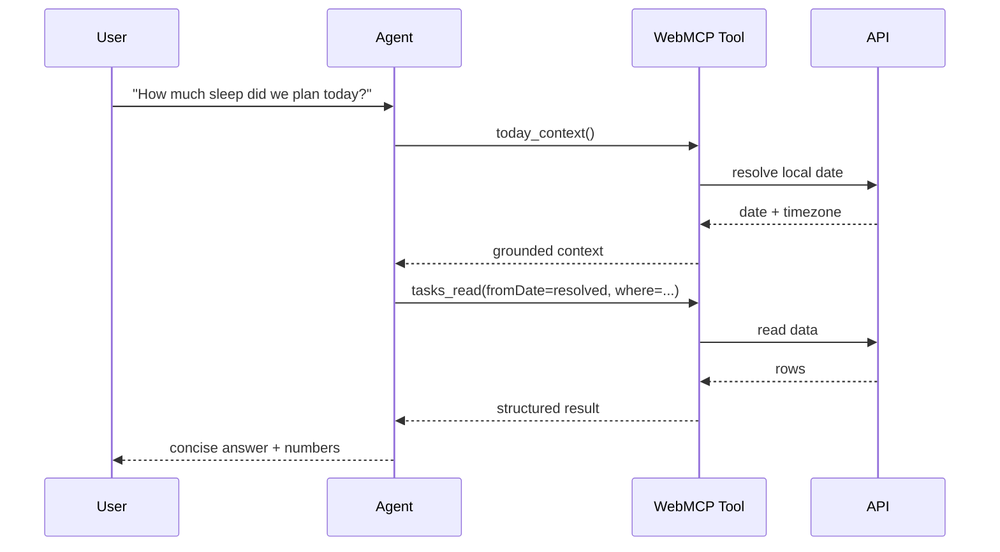
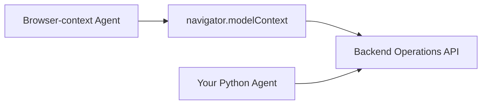
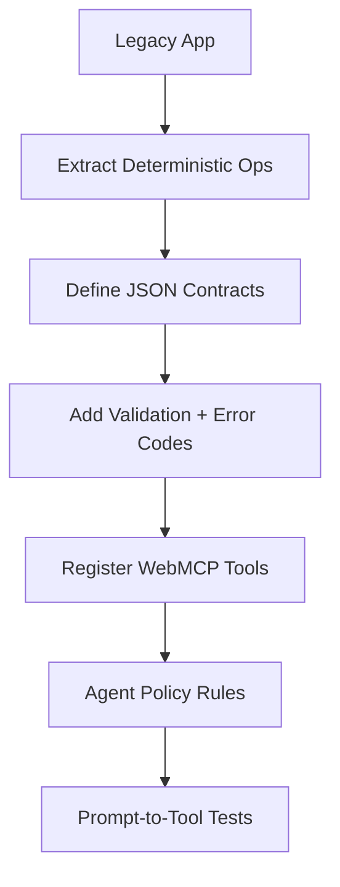
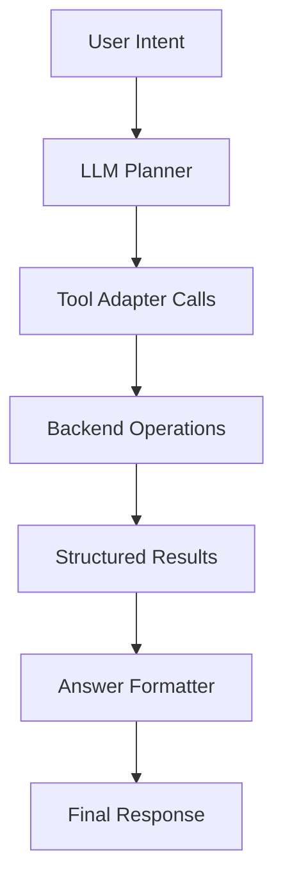
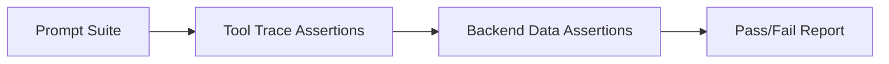
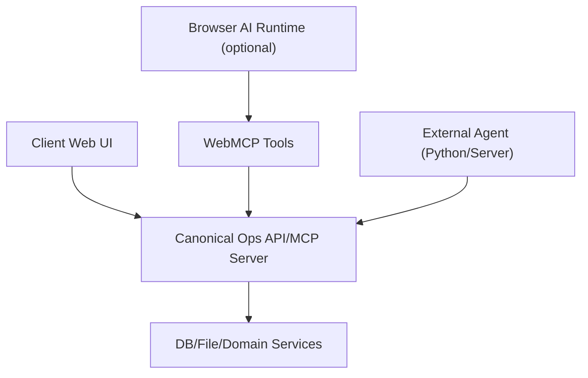
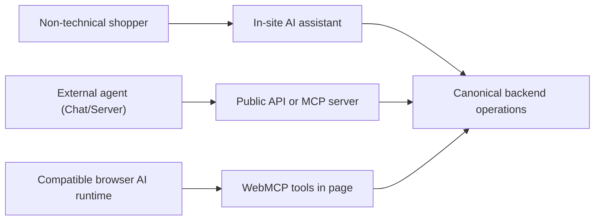

## 1. What WebMCP Is

WebMCP is a browser-native way for a web app to expose callable tools to an AI runtime through `navigator.modelContext`.

In plain terms:

- Your app registers tools.
- A compatible AI runtime discovers those tools.
- The runtime invokes them with structured arguments.
- Your app returns structured results.

WebMCP gives you **in-page tool calling**, not a universal backend API by itself.



Here's a demo showing how we can add WebMCP tools and have an agent call them to get things done on the Web, not just answer questions.

<div style="background: #fef2f2; border: 2px solid #fca5a5; border-radius: 8px; padding: 1.5rem; margin: 2rem 0;">

**Before watching the video, note the following things:**

<ul style="list-style: none; padding: 0; margin: 1rem 0;">
<li style="position: relative; padding: 0.75rem 0.75rem 0.75rem 3rem; margin-bottom: 0.75rem; background: #dbeafe; border-radius: 6px; border-left: 3px solid #6366f1;">
<span style="position: absolute; left: 0.75rem; top: 50%; transform: translateY(-50%); width: 1.5rem; height: 1.5rem; background: #6366f1; color: white; border-radius: 50%; display: inline-flex; align-items: center; justify-content: center; font-weight: bold; font-size: 0.75rem;">✓</span>
The application was <strong>not built with AI interaction in mind</strong>. It was a pure mobile first application to track sleep and tasks.
</li>
<li style="position: relative; padding: 0.75rem 0.75rem 0.75rem 3rem; margin-bottom: 0.75rem; background: #dbeafe; border-radius: 6px; border-left: 3px solid #6366f1;">
<span style="position: absolute; left: 0.75rem; top: 50%; transform: translateY(-50%); width: 1.5rem; height: 1.5rem; background: #6366f1; color: white; border-radius: 50%; display: inline-flex; align-items: center; justify-content: center; font-weight: bold; font-size: 0.75rem;">✓</span>
The WebMCP tools were added in <strong>a few minutes</strong>.
</li>
<li style="position: relative; padding: 0.75rem 0.75rem 0.75rem 3rem; margin-bottom: 0.75rem; background: #dbeafe; border-radius: 6px; border-left: 3px solid #6366f1;">
<span style="position: absolute; left: 0.75rem; top: 50%; transform: translateY(-50%); width: 1.5rem; height: 1.5rem; background: #6366f1; color: white; border-radius: 50%; display: inline-flex; align-items: center; justify-content: center; font-weight: bold; font-size: 0.75rem;">✓</span>
On the <strong>right side</strong> of the screen we are asking the agent to add a bunch of tasks to my day.
</li>
<li style="position: relative; padding: 0.75rem 0.75rem 0.75rem 3rem; margin-bottom: 0.75rem; background: #dbeafe; border-radius: 6px; border-left: 3px solid #6366f1;">
<span style="position: absolute; left: 0.75rem; top: 50%; transform: translateY(-50%); width: 1.5rem; height: 1.5rem; background: #6366f1; color: white; border-radius: 50%; display: inline-flex; align-items: center; justify-content: center; font-weight: bold; font-size: 0.75rem;">✓</span>
On the <strong>left side</strong>, after refreshing the page, you can see the tasks have been added to the app's UI, which is reading from the same backend that the WebMCP tools are calling.
</li>
</ul>

</div>

[yt:VBCwXztkfPo]

## 2. What WebMCP Is Not

You should not confuse WebMCP with a backend protocol endpoint.

- It is not automatically a Python-accessible service.
- It is not a replacement for your server API.
- It is not a complete agent framework by itself.

The builder’s rule: treat WebMCP as a **presentation-layer tool bus** inside browser context.

## 3. Core Mental Model

When we design with WebMCP, we split the system into three layers:

1. **Tool Surface**: browser-registered tools with JSON schema.
2. **Execution Core**: deterministic business operations (CRUD, search, summarize).
3. **Agent Brain**: model instructions/policies deciding which tool to call.



If you keep these layers separate, your system stays debuggable and portable.

## 4. First Implementation: Register a Tool

We always start with one read-only tool and prove end-to-end flow.

```ts
navigator.modelContext?.registerTool({
  name: 'tasks_read',
  title: 'Read Tasks',
  description: 'Read tasks by date range and filter.',
  inputSchema: {
    type: 'object',
    required: ['fromDate'],
    properties: {
      fromDate: { type: 'string' },
      toDate: { type: 'string' },
      where: {
        type: 'object',
        properties: {
          labelContains: { type: 'string' },
          status: { type: 'string' }
        }
      }
    }
  },
  execute: async (args) => {
    const r = await fetch('/api/tasks/read', {
      method: 'POST',
      headers: { 'Content-Type': 'application/json' },
      body: JSON.stringify(args),
    });
    return await r.json();
  }
});
```

Builder note: a reliable read tool gives the model context grounding and prevents hallucinated state.

## 5. Tool Design Principles We Should Use

### 5.1 Keep tools composable

Use generic primitives first:

- `read`
- `create`
- `update`
- `delete`

Then optionally add high-level tools when repeated patterns appear.

### 5.2 Prefer strict schemas

We want the runtime to reject malformed arguments early.

- explicit required fields
- constrained enums
- typed objects
- bounded arrays

### 5.3 Return predictable JSON

Every tool should return a stable envelope:

```json
{
  "ok": true,
  "data": {},
  "meta": {}
}
```

or

```json
{
  "ok": false,
  "error": "human-readable message",
  "code": "MACHINE_CODE"
}
```

Consistency here is what makes agents robust.

## 6. How the AI Actually Communicates

You need to explicitly teach the model how to think with tools.

We do that with policy instructions like:

1. Read before reasoning about user data.
2. Resolve relative dates first.
3. Use fuzzy filters unless exact match is requested.
4. Ask confirmation before destructive bulk actions.



The model is only as good as the policy and tool contract you give it.

## 7. Browser Runtime vs Your Own Agent

Here is the practical truth:

- A browser-context runtime can call `navigator.modelContext` directly.
- Your Python service cannot directly call `navigator.modelContext`.

So if you are building your own agent service, use a backend contract (HTTP or MCP server) and optionally mirror the same operations in WebMCP.



This dual-surface model is the most practical production architecture.

## 8. How to Add WebMCP to an Existing Project (Migration Playbook)

You have an old app and want WebMCP compatibility. Do this in order.

### Step 1: Extract deterministic operations

From controllers/services, identify operations that are already deterministic.

- read/list/search
- create
- update
- delete
- summarize (optional)

### Step 2: Define a stable backend contract

Before touching WebMCP, define clear request/response JSON for each operation.

### Step 3: Add validation and error semantics

- schema validation
- machine-readable error codes
- safe defaults

### Step 4: Register WebMCP tools in the web client

Expose each operation as a tool with matching schemas.

### Step 5: Add an AI policy layer

Teach the model when to call which tool and in what order.

### Step 6: Add tests for tool contracts

- schema validation tests
- operation tests
- end-to-end prompt-to-tool tests



## 9. Creating the AI Layer That Talks Correctly

Let us show you the practical stack:

- **Tool adapters**: tiny wrappers around your backend operations.
- **Policy prompt**: strict procedural rules for tool usage.
- **Post-processing**: convert tool output into concise user-facing language.
- **Safety gates**: confirmation logic for destructive actions.

### Minimal policy template

```text
You are a tool-using assistant.
If the user asks about records, call read tools before answering.
If relative dates appear, call date-context tool first.
For deletes/updates, summarize affected records and require confirmation for bulk changes.
Return concise answers with computed values and source scope.
```

### Minimal capability stack



## 10. Testing Strategy we Recommend

### 10.1 Contract tests

Validate each tool input/output shape.

### 10.2 Behavior tests

For each user intent category, assert expected tool sequence.

### 10.3 Regression prompts

Maintain a fixed suite:

- retrospective backfill
- task search/remove
- planned vs actual sleep

### 10.4 Date-grounding tests

Ensure “today/yesterday/tomorrow” resolve via explicit context tool.



## 11. Production Architecture Pattern

If we were shipping this for clients today, we would do this:

- Keep backend operations as canonical interface.
- Expose WebMCP only where browser runtime supports it.
- Let external agents (Python, server-side) use the same backend operations.
- Do not force browser extensions for end users.



This gives you one source of truth and multiple agent surfaces.

## 12. Who Actually Uses WebMCP (and How We Position It)

This is the practical distribution truth: most non-technical users do not wake up wanting “WebMCP,” they want faster shopping, easier checkout, and fewer clicks.

We should position WebMCP as an internal capability, not the headline user feature.

- User-facing message: “Use our AI shopping assistant to find products, compare options, and build your cart quickly.”
- Technical message (for partners/developers): “Our site exposes AI-callable operations and is WebMCP-compatible in supported runtimes.”

Who uses WebMCP directly:

- Browser-hosted AI runtimes/extensions that can read `navigator.modelContext`.
- Developers testing and integrating advanced agent workflows.

Who usually does not use WebMCP directly:

- Typical ChatGPT/Claude end users outside your website context.
- Customers who do not install specialized browser tooling.

So in production, we should support multiple channels:

1. In-site AI assistant for regular customers (no protocol knowledge required).
2. Backend API/MCP server for external agents and partner integrations.
3. Optional WebMCP layer for compatible browser runtimes.



Guidance on “advertising compatibility”:

- Primary marketing should describe outcomes, not protocols.
- Add a small technical page for developers: capabilities, auth model, limits, and sample calls.
- If WebMCP support exists, mention it in that developer page as an optional integration path.

## 13. Quick Start Checklist

- [ ] Define backend CRUD/summarization contracts.
- [ ] Register one read-only WebMCP tool.
- [ ] Add date-context tool.
- [ ] Add update/delete confirmation policy.
- [ ] Add traceable regression prompts.
- [ ] Expose same operations to external agents.

If you follow this sequence, you will get a system that is both agent-friendly and production-ready.

## 14. Sources to Track

- Model Context Protocol org: [https://github.com/modelcontextprotocol](https://github.com/modelcontextprotocol)
- MCP specification repository: [https://github.com/modelcontextprotocol/modelcontextprotocol](https://github.com/modelcontextprotocol/modelcontextprotocol)
- MCP-B docs: [https://docs.mcp-b.ai](https://docs.mcp-b.ai)
- WebMCP npm packages: [https://github.com/WebMCP-org/npm-packages](https://github.com/WebMCP-org/npm-packages)

The ecosystem is moving fast, so always verify package/API signatures against the exact versions you install.
